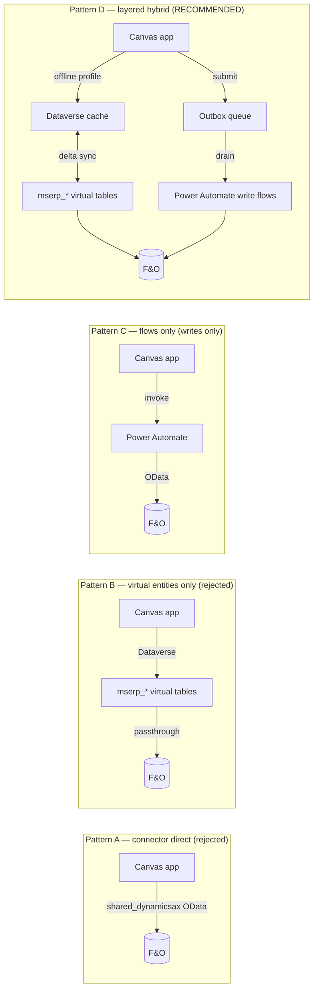
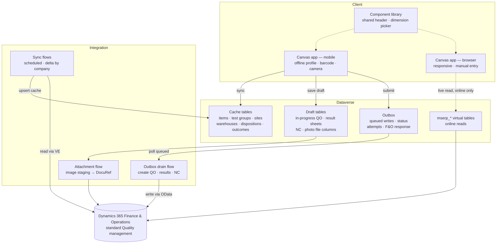
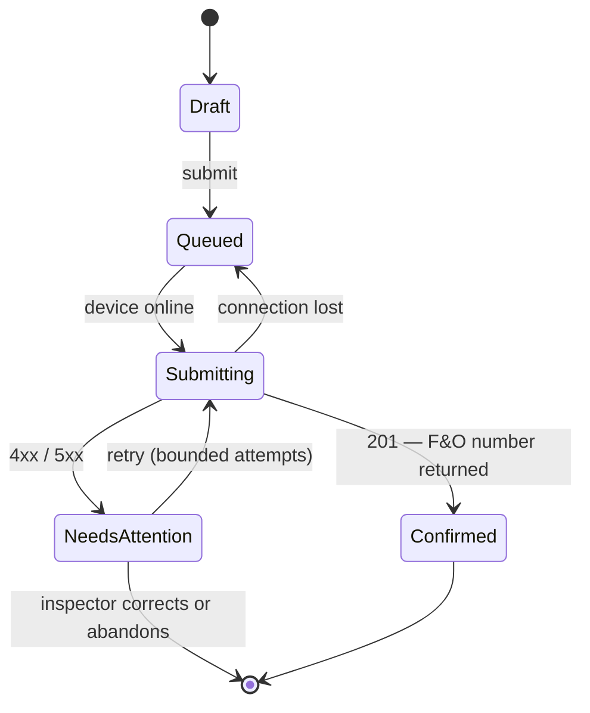
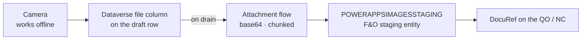

# Quality Management Canvas App — Solution Architecture

| | |
|---|---|
| **Document** | QM-ARCH-001 |
| **Revision** | 1.0 — Final |
| **Date** | 2026-08-14 |
| **Environment** | `cus-con-sandbox` |
| **Source spec** | Quality Management App — User Manual V3 |
| **Status** | Approved for build |
| **Supersedes** | Rev 0.1 (draft) |

A rebuild and modernisation of the Quality Management mobile app for Dynamics 365 Finance & Operations — covering quality order creation, test result capture, non-conformance handling and batch disposition, on mobile **with offline capability** and on desktop browser.

---

## Contents

1. [Purpose and scope](#1-purpose-and-scope)
2. [Verified environment baseline](#2-verified-environment-baseline)
3. [Decision register](#3-decision-register)
4. [Integration options and recommendation](#4-integration-options-and-recommendation)
5. [Target architecture](#5-target-architecture)
6. [Screen-to-entity map](#6-screen-to-entity-map)
7. [Offline design](#7-offline-design)
8. [Multi-company resolution](#8-multi-company-resolution)
9. [Photo attachments](#9-photo-attachments)
10. [UI standard](#10-ui-standard)
11. [Technology summary and licensing](#11-technology-summary-and-licensing)
12. [Both paths: with and without X++](#12-both-paths-with-and-without-x)
13. [Security and ALM](#13-security-and-alm)
14. [Effort and delivery sequence](#14-effort-and-delivery-sequence)
15. [Delivery model](#15-delivery-model)
16. [Risks and open items](#16-risks-and-open-items)

---

## 1. Purpose and scope

This document defines the target architecture for rebuilding the Quality Management app as a Power Apps canvas application against D365 Finance & Operations in the `cus-con-sandbox` environment. The functional scope is taken from *Quality Management App — User Manual V3*, re-thought for current platform capabilities rather than reproduced as a 2023-era copy.

### 1.1 In scope

- **Quality orders** — creation across all seven reference types: Sales, Purchase, Inventory, Production, Route operation, Co-product production, Quarantine.
- **Enter test results** — select a quality order, record per-test outcomes and measured values, save and submit back to F&O.
- **Non-conformance** — creation across all six types: Internal, Customer, Vendor, Service request, Production, Co-product production.
- **Batch disposition** — barcode scan of item and batch, then change of disposition code.
- **Photo attachments** against quality orders and non-conformances.
- **Offline operation** on mobile — committed scope as of Rev 1.0.
- **Responsive desktop browser** experience for supervisors.

### 1.2 Out of scope

Quality configuration and master data maintenance (test groups, test definitions, item sampling, quality associations) remain in the F&O client. The app consumes this configuration; it does not maintain it. Reporting and analytics, and any Copilot Studio agent surface, are excluded from this revision.

---

## 2. Verified environment baseline

Every statement in this section was confirmed by querying `cus-con-sandbox` directly on 2026-08-14. Nothing here is assumed from documentation.

### 2.1 Platform

| Component | Finding | State |
|---|---|---|
| Dataverse organisation | `operations-cus-con-sandbox.crm.dynamics.com`, org `eb776e2d…`, geo NA | Live |
| F&O virtual entities | `MicrosoftOperationsERPVE` v2.20.3417.1, plus VE Anchor, VE Support, ERP Catalog | Provisioned |
| Virtual entity catalogue | `mserp_financeandoperationsentity` queryable; entity generation is self-service | Available |
| Dual-write | `DualWriteCoreAnchor`, `Dynamics365FinanceAndOperationsDualWriteMaps`, SupplyChainExtended installed | Present, unused here |
| F&O connector | `shared_dynamicsax` proven across many live connection references, e.g. *Dynamics 365 F&O — WDTC sandbox* | Proven |
| F&O quality module | Standard Quality management, extended by a QMS add-on (`QMSAnchor` publisher, ~20 `QMS*` entities) | Both present |
| Prior quality work | Solutions `QUA01QualityAgent`, `QUA02QualityAgent`; NC record `QUA02-A260805131635` already written to F&O by an agent | Existing |

### 2.2 The decisive finding: a purpose-built entity layer already exists

The F&O entity catalogue contains a family of roughly **31 data entities named for Power Apps consumption** — `POWERAPPS*`, `POWERAPP*` and `INVENTQUALITYORDERLINEENTITYPOWERAPP`. They map almost one-to-one onto the screens in the user manual: quarantine orders, non-conformations, disposition masters, batch tracing, inventory dimension combinations, production route operations, co-product batch orders, test variable outcomes — and, critically, `POWERAPPSIMAGESSTAGING` and `POWERAPPFILESAVINGENTITY` for photo upload.

This is the read layer the original app was built on. It has not been removed. Six of these entities are already generated as virtual tables; the rest need only be switched on. That materially reduces the build and is the single strongest input to the recommendation in §4.

### 2.3 Proven data paths

Three generated virtual tables were queried and returned live F&O data across multiple legal entities:

| Virtual table | Sample returned |
|---|---|
| `mserp_inventqualityorderheaderentity` | QO `000122` / item `P2100` "P2100 Industrial Cleaner" / batch `B-000031` / `USPI`; QO `000122` / `D0004` "HighEndSpeaker" / test group `Cone` / `USMF` |
| `mserp_inventqualityorderlineresultentity` | QO `000121` tests `Viscosity` 400, `SpecGravity` 1.040, `AromaCl` — all Pass; QO `000119` `Enclosure measuring` → Fail, outcome "To small" |
| `mserp_inventnonconformancetableentity` | NC `00057` Vendor / `D0006` / problem type `Deviating Impedance` / vendor `US-105` / 2 ea; NC `00059` Production / `P000152` / 22 ea |

Both quality tables expose `mserp_dataareaid` as a value and `mserp_dataareaid_id` as a lookup, which is what makes the multi-company design in §8 workable.

---

## 3. Decision register

| Ref | Decision | Consequence |
|---|---|---|
| `D-01` | Rebuild *and* modernise — same functional scope as V3, re-thought for current platform | Modern controls, responsive containers, named formulas, component library |
| `D-02` | **Offline capability is committed scope**, plus desktop browser | Requires a Dataverse persistence layer — see §7 |
| `D-03` | Standard F&O Quality management is the system of record | Build against `InventQualityOrder*` / `InventNonConformance*`; QMS fields carried but not driven |
| `D-04` | Multi-company, legal entity derived from the signed-in user | No company picker unless the user has several; all reads filtered by `dataareaid` |
| `D-05` | Photo attachments into F&O are in scope | Routed through `POWERAPPSIMAGESSTAGING` — see §9 |
| `D-06` | X++ capability undecided — both paths documented | Architecture works with no F&O code change; §12 marks where custom work would help |
| `D-07` | **Integration pattern: layered hybrid** (Pattern D) | Reads via virtual entities into a Dataverse cache; writes via Power Automate through an outbox |
| `D-08` | **UI standard: Option 3 inspection sheet** for test result entry; **Option 3 header with Option 4 progressive lookups** for creation forms | Single component per family, configured per type — see §10 |
| `D-09` | **Visual treatment: A — Instrument** (cool teal on soft neutrals) | Palette expressed as theme variables in one component for later brand substitution |
| `D-10` | **Build sequence: online-first, with the persistence seam in place from the start** | Offline becomes additive rather than a retrofit — see §14 |

### 3.1 The constraint that decides the architecture

> **Power Apps offline capability for canvas apps is built on offline profiles, which support Dataverse tables only.** Virtual tables are not supported in an offline profile, and connector-sourced data (including `shared_dynamicsax`) cannot be made offline-capable at all.

Offline (`D-02`) therefore **requires** real Dataverse tables holding a synchronised copy of the data the app reads, plus a queue for writes made while disconnected. This is a technical consequence of the offline decision, not an optional extra.

---

## 4. Integration options and recommendation

Four viable integration patterns were assessed. The differentiator is not whether each can read a quality order — all of them can — but how each behaves under delegation limits, offline operation and transactional writes.



Patterns A, B and C all terminate at F&O with nothing that survives a lost connection. Pattern D adds exactly two components — a Dataverse cache the offline profile can synchronise, and an outbox that holds writes until the device reconnects.

### 4.1 Assessment

| Pattern | Strengths | Weaknesses | Verdict |
|---|---|---|---|
| **A — F&O connector direct** | Fastest to prototype; proven repeatedly in this environment | Weak delegation, large tables truncate; `GetItems` has no `$expand` and rejects present-but-empty `$filter`/`$select`; **no offline path** | Rejected — fails `D-02` |
| **B — Virtual entities only** | Already provisioned; `POWERAPPS*` family designed for exactly this; good delegation, one connector, one security model | Writes limited to what each data entity supports — no business actions; **virtual tables cannot join an offline profile** | Rejected alone — fails `D-02` |
| **C — Power Automate for everything** | Full control over multi-step logic; can reach custom services | Seconds of latency per interaction; non-delegable; flow run volume becomes a licensing cost | Retained for **writes only** |
| **D — Layered hybrid** | Each job goes to the mechanism that does it best | More moving parts; requires the Dataverse layer | **Recommended** (`D-07`) |

### 4.2 Why D, stated plainly

The offline requirement eliminates A, B and C outright, because none of them can hold data or accept input on a disconnected device. Once a Dataverse layer has to exist anyway, the remaining question is what to point it at — and virtual entities are the better source than the F&O connector, because they delegate properly, they carry `dataareaid` natively, and the `POWERAPPS*` entity family was purpose-built for this app's read patterns.

Writes stay in Power Automate rather than being pushed through virtual entities for a specific reason: **creating a quality order is not an insert.** It is a business operation that validates against item sampling, test group assignment and inventory dimensions, and it can fail for reasons the app must explain to an inspector standing at a bench. A flow gives that a place to live, along with retry and an audit trail. Reads that are cheap and safe stay on the fast path; writes that are expensive and consequential go through the controlled one.

---

## 5. Target architecture



**Reads and writes take deliberately different routes.** Reference data lands in Dataverse cache tables that the offline profile can synchronise; live transactional reads bypass the cache when the device is online; every write becomes an outbox row that a flow drains into F&O, so a submission made in a warehouse dead spot is not lost.

### 5.1 Component inventory

| Component | Technology | Purpose |
|---|---|---|
| Quality Management app | Canvas app, tablet layout, responsive containers | Single app serving mobile and browser |
| Shared UI kit | Canvas component library | App header (home / back / forward / refresh), inventory dimension picker, test result row, scan control, progressive field group, verdict pill |
| Cache tables | Dataverse standard tables, publisher prefix `cog` | Items, test groups, tests, outcomes, sites, warehouses, locations, inventory statuses, disposition codes, problem types, customers, vendors |
| Draft tables | Dataverse standard tables + file columns | In-progress quality orders, result sheets, non-conformances, captured photos |
| Outbox | Dataverse table with status, attempt count, payload, F&O response | Durable write queue and audit trail |
| Virtual tables | `mserp_*` generated from the F&O catalogue | Source for sync, and live reads when online |
| Sync flows | Power Automate, scheduled, one per domain | Delta-refresh cache per legal entity |
| Write flows | Power Automate, Dataverse-triggered on outbox insert | Create quality order, post test results, create NC, change batch disposition |
| Attachment flow | Power Automate | File column → `POWERAPPSIMAGESSTAGING` → F&O document attachment |
| Environment variables | Dataverse | F&O base URL, sync cadence, cache retention, feature flags |
| Connection references | Dataverse | `shared_commondataserviceforapps`, `shared_dynamicsax` |

---

## 6. Screen-to-entity map

Every screen in the user manual is traced to the F&O data entity that backs it. The *Virtual table* column reflects the actual state of `cus-con-sandbox` today — **Generated** means already switched on and returning data; **Generate** means it exists in the catalogue and needs enabling, a configuration task with no code.

| Screen / function | F&O data entity | Virtual table |
|---|---|---|
| Quality order header — all seven types | `InventQualityOrderHeaderEntity` | Generated |
| Enter test results — result lines | `InventQualityOrderLineResultEntity` | Generated |
| Non-conformance — all six types | `INVENTNONCONFORMANCETABLEENTITY` | Generated |
| Quarantine quality order | `POWERAPPSINVENTQUARANTINEORDERENTITY` | Generated |
| Batch disposition — batch lookup | `POWERAPPITEMBATCHTRACINGENTITY` | Generated |
| Site / warehouse / on-hand reference | `InventSiteAIEntity`, `InventLocationAIEntity`, `InventOnHandAIEntity` | Generated, change-tracked |
| Vendor account selection | `VendVendorV2Entity` | Generated |
| NC form optimised for the app | `POWERAPPSINVENTNONCONFORMATIONENTITY` | Generate |
| Quality order lines for result entry | `POWERAPPINVENTQOLINEENTITY`, `INVENTQUALITYORDERLINEENTITYPOWERAPP` | Generate |
| Batch disposition codes | `POWERAPPSPDSDISPOSITIONMASTERENTITY` | Generate |
| Test groups | `InventQualityTestGroupEntity` | Generate |
| Test outcome options | `POWERAPPSINVENTTESTVARIABLEOUTCOMEENTITY`, `InventQualityTestVariableOutcomeEntity` | Generate |
| Inventory dimensions — site, location, status, LP | `POWERAPPSINVENTSITE`, `POWERAPPSINVENTLOCATION`, `POWERAPPSWHSINVENTSTATUSENTITY`, `POWERAPPSWHSLICENSEPLATEENTITY` | Generate |
| Product dimensions — configuration, colour, size, style | `POWERAPPSINVENTCOLOR`, `POWERAPPINVENTDIMCOMBENTITY`, `POWERAPPSECORESPRODUCTDIMENSIONGROUPPRODUCTENTITY` | Generate |
| Production order selection | `POWERAPPSPRODTABLEENTITY` | Generate |
| Route operation selection | `POWERAPPSPRODPRODUCTIONORDERROUTEOPERATIONENTITY` | Generate |
| Co-product production order | `POWERAPPPRODBATCHORDERCOPRODUCTENTITY` | Generate |
| Customer account selection | `POWERAPPSCUSTTABLEENTITY` | Generate |
| Item / on-hand for inventory QO | `POWERAPPSINVENTTABLEINVENTORYENTITY`, `POWERAPPINVENTSUMENTITY` | Generate |
| NC problem types | `INVENTPROBLEMTYPEDATAENTITY` | Generate |
| Batch numbers | `INVENTBATCHENTITY`, `POWERAPPINVENTBATCHTMPENTITY` | Generate |
| Photo attachment staging | `POWERAPPSIMAGESSTAGING`, `POWERAPPFILESAVINGENTITY` | Generate |

### 6.1 Key fields, as they actually exist

Field names below were read from the live virtual tables, not inferred.

**`mserp_inventqualityorderheaderentity`**

`mserp_qualityordernumber`, `mserp_qualityorderstatus`, `mserp_referencetype`, `mserp_itemnumber`, `mserp_productname`, `mserp_qualitytestgroupid`, `mserp_inventoryquantity`, `mserp_inventorysiteid`, `mserp_warehouseid`, `mserp_warehouselocationid`, `mserp_itembatchnumber`, `mserp_licenseplatenumber`, `mserp_inventorystatusid`, `mserp_productconfigurationid`, `mserp_productcolorid`, `mserp_productsizeid`, `mserp_productstyleid`, `mserp_customeraccountnumber`, `mserp_vendoraccountnumber`, `mserp_salesordernumber`, `mserp_purchaseordernumber`, `mserp_productionordernumber`, `mserp_inventorylotid`, `mserp_validateddatetime`, `mserp_dataareaid`

**`mserp_inventqualityorderlineresultentity`**

`mserp_qualityordernumber`, `mserp_qualityordersequencenumber`, `mserp_qualitytestid`, `mserp_testresult`, `mserp_resultvalue`, `mserp_qualitytestvariableoutcomeid`, `mserp_resultinventoryquantity`, `mserp_resultlinenumber`, `mserp_istestvalidationincludingresult`, `mserp_dataareaid`

**`mserp_inventnonconformancetableentity`**

`mserp_inventnonconformanceid`, `mserp_inventnonconformancetype`, `mserp_inventtestproblemtypeid`, `mserp_itemid`, `mserp_nonconformancedate`, `mserp_testdefectqty`, `mserp_unitid`, `mserp_custaccount`, `mserp_vendaccount`, `mserp_inventrefid`, `mserp_inventtranstype`, `mserp_inventtestquarantinetype`, `mserp_quarantinezoneid`, `mserp_inventnonconformanceapproval`, `mserp_closed`, `mserp_rush`, `mserp_dataareaid`

> **QMS extension fields.** Both quality tables carry QMS add-on columns — `mserp_qmspriorityid`, `mserp_qmssampleid`, `mserp_qmssampleinspectionmethod`, `mserp_qmsresultnote`, `mserp_qmstestinstrumenttagnumber`, `mserp_qmsaqldefectquantity` and others. Per `D-03` the app does not drive these, but it must not blank them on update. **All write flows patch only the fields the app owns — never a full-record PUT.**

---

## 7. Offline design

Offline splits into three separate problems: having the reference data on the device, letting an inspector complete work without a connection, and getting that work into F&O once the connection returns.

### 7.1 Reference data on the device

Cache tables are included in the app's offline profile with filters scoped to the user's legal entity and, where volume warrants, their site.

| Data | Churn | Volume | Sync cadence | Filter |
|---|---|---|---|---|
| Items, test groups, tests, outcomes | Low | Small | Every 4 hours | Legal entity |
| Disposition codes, problem types, inventory statuses | Low | Small | Daily | Legal entity |
| Sites, warehouses, locations | Low | Small | Daily | Legal entity |
| Customers, vendors | Medium | Medium | Every 4 hours | Legal entity |
| Open quality orders | High | Medium | Every 15 minutes | Legal entity + site |
| Batches, on-hand | High | Large | Every 15 minutes | Legal entity + warehouse |

### 7.2 Working disconnected

Draft tables hold work in progress. An inspector can open a quality order that synced earlier, record results against every test, capture photos and submit — all against local data. **The submit action writes an outbox row rather than calling F&O.**

### 7.3 Draining the queue



A submission is never lost and never silently duplicated. The outbox row is the single record of intent; the flow moves it between states and stamps the F&O document number on success. Transient failures retry within a bounded attempt count; business rejections surface the F&O message to the inspector rather than retrying forever.

### 7.4 Idempotency — non-negotiable

The drain flow must be idempotent. Each outbox row carries a **client-generated correlation GUID** that is written to a field on the F&O record; before creating, the flow checks whether a record with that correlation already exists.

Without this, a retry after a timeout that actually succeeded creates a duplicate quality order — the most likely failure mode in a warehouse with marginal connectivity.

### 7.5 What is not available offline

Two things degrade honestly rather than pretending to work:

- **Live on-hand quantity** is shown with the timestamp of its last sync, so an inspector knows how stale it is.
- **Number sequences** are assigned by F&O, so an offline submission shows "pending" in place of a quality order number until the outbox drains.

---

## 8. Multi-company resolution

Per `D-04` the legal entity is derived from the signed-in user rather than picked. On first launch the app calls a resolution flow that reads the user's default company from F&O and the set of companies they are authorised for, then caches the result in a Dataverse user-preference row.

- **One company** — resolved silently, shown read-only in the app header.
- **Several companies** — the default is pre-selected and a switcher appears in the header. Switching clears draft context and re-scopes the cache filter.
- **Every read** filters on `mserp_dataareaid`; every write flow sets the F&O company context and passes `cross-company=true` where the entity requires it.

The sample data confirms this matters in practice: **quality order `000122` exists independently in both `USPI` and `USMF` with entirely different items.** Any screen that keys on the order number alone without company scoping will show the wrong record.

---

## 9. Photo attachments

The manual's attachment feature — photograph the item, upload against the quality order or non-conformance — has no direct route. There is **no `DocumentAttachment` data entity for quality orders or non-conformances** in this F&O instance; the pattern exists for sales orders, return orders, released products and assets, but not for quality. The `POWERAPPSIMAGESSTAGING` and `POWERAPPFILESAVINGENTITY` entities exist precisely to bridge that gap.



The photo never blocks the inspector. Capture writes to a Dataverse file column that works offline; the upload to F&O happens when the outbox drains, after the parent record exists and has a document number to attach against.

> **To be validated in build (risk R1).** `POWERAPPSIMAGESSTAGING` has not yet been generated as a virtual table, so its field shape and whether it accepts writes are unconfirmed. This is the highest-uncertainty element of the design. Validate it in Phase 1: if it proves read-only or does not link staged images to a `DocuRef`, the fallback is to store photos in Dataverse and surface them through a link on the F&O record — which loses in-F&O viewing and must be agreed with the business.

---

## 10. UI standard

Per `D-08` and `D-09`, the following is the agreed UI standard for all screens. Design options were evaluated separately; this section records only the decision.

### 10.1 Layout pattern by screen family

| Screen family | Pattern | Rationale |
|---|---|---|
| **Test result entry** | **Inspection sheet** — one dense screen, all tests in a grid, tolerance visible, verdict computed live | Run dozens of times a shift by people who know the tests by heart. Speed and whole-sheet visibility beat hand-holding. The live verdict removes the most common error — submitting a sheet without noticing it fails. |
| **Quality order creation** (7 types) | **Inspection-sheet header + progressive lookups** — resolved context collapses into a strip; each answer reveals the next field | Run occasionally; the difficulty is the cascading dependency chain, not field count. Progressive reveal makes dependencies impossible to get wrong. |
| **Non-conformance creation** (6 types) | Same as quality order creation | One component, account field swapped by type |
| **Batch disposition** | Scan-first, with an explicit consequence preview before confirm | Adds "releases 1.00 ea to available stock" before committing — the V3 screen does not show this |
| **Supervisor / desktop** | Nav rail + summary tiles + list | Same app, wide layout; the tile grid becomes a rail and the list gains the summary a phone user does not need |

**Fallback:** if pilot users turn out to be occasional or heavily gloved, the guided-steps (wizard) pattern is the pre-agreed alternative. It is the safest design and the slowest one. Decide from the pilot, not now.

### 10.2 Visual treatment — A, Instrument

Cool teal on soft neutrals. Reads as a measuring device rather than a business app; safest for a mixed audience of inspectors and supervisors.

| Token | Light | Dark |
|---|---|---|
| Ground | `#F4F6F7` | `#0B1215` |
| Surface | `#FFFFFF` | `#131E22` |
| Ink | `#101A1E` | `#E5EDEF` |
| Accent | `#0D6273` | `#57B9CD` |
| Pass | `#20613D` | `#5FC78E` |
| Fail | `#9C1F17` | `#F09189` |
| Hold / pending | `#8A5606` | `#E2AC45` |

**Rules:**

- Palette lives in **one theme component** as variables, so a brand colour can be swapped without touching screens.
- **Pass / fail / hold colours stay out of the brand palette.** They carry meaning and must remain distinguishable for colour-blind users.
- **Every verdict is labelled in text, not only coloured.**
- Auto-populated fields are visibly read-only (dashed border, recessed surface) rather than looking editable.

### 10.3 Reference screen — test result entry

```
┌────────────────────────────────────────┐
│ 10:04                    ◐ Offline     │
├────────────────────────────────────────┤
│ ←   QO 000122                          │
│     P2100 · B-000031 · Production      │
├────────────────────────────────────────┤
│ (Qty 1.00) (Group P2100-CSB) (Site 1)  │
│ ┌────────────────────────────────────┐ │
│ │ TEST                       RESULT  │ │
│ ├────────────────────────────────────┤ │
│ │ Ph Test                            │ │
│ │ 6.5–7.5 · PhMeter01   [ 5.9] FAIL  │ │
│ ├────────────────────────────────────┤ │
│ │ Temp                               │ │
│ │ 18–24 °C              [21.4] PASS  │ │
│ ├────────────────────────────────────┤ │
│ │ Turbidity                          │ │
│ │ max 5.0 NTU           [  — ]  —    │ │
│ ├────────────────────────────────────┤ │
│ │ AromaCl                            │ │
│ │ Outcome list          [  — ]  —    │ │
│ └────────────────────────────────────┘ │
│ ORDER VERDICT           Fail · 1 of 4  │
├────────────────────────────────────────┤
│ [ Photo ]        [ Save & submit ]     │
└────────────────────────────────────────┘
```

Four tests, tolerances, live verdict, no scrolling. Offline state and cache age stated in the status bar.

---

## 11. Technology summary and licensing

| Layer | Technology | Rationale |
|---|---|---|
| Client | Power Apps canvas app, tablet format, responsive containers, modern controls | One app for phone, tablet and browser; barcode and camera on device |
| Reuse | Canvas component library + named formulas | Seven quality order types and six NC types share one form component each |
| Offline | Power Apps offline profiles over Dataverse tables | The only supported offline mechanism for canvas apps |
| Local store | Dataverse standard tables (cache, draft, outbox) | Required by offline; also gives an audit trail and delegable queries |
| ERP read | F&O virtual entities `mserp_*` via Dataverse connector | Already provisioned; delegable; `POWERAPPS*` family purpose-built for these screens |
| ERP write | Power Automate → F&O OData via `shared_dynamicsax` | Retry, idempotency, error surfacing; proven in this environment |
| F&O fallback | HTTP with Microsoft Entra ID (`shared_httpwithazureadrev1`) | Route if the `shared_dynamicsax` apihub route breaks in a target tenant |
| Attachments | Dataverse file column → flow → `POWERAPPSIMAGESSTAGING` | No quality-specific DocumentAttachment entity exists |
| Config | Environment variables + connection references | No environment-specific literals in app or flow definitions |
| ALM | Unmanaged in Dev, managed downstream; unpacked solution in source control | Consistent with the environment's existing delivery standard |

### 11.1 Licensing

Every user needs **Power Apps Premium** — Dataverse and both the F&O and Dataverse connectors are premium, and offline profiles require Dataverse. Users who also hold a qualifying **D365 F&O** licence have canvas app rights included for apps that extend F&O; confirm against the current licensing guide before costing, as team composition (inspectors vs supervisors) changes the answer.

Flow runs are consumed by sync and drain — size the sync cadence in §7.1 against the run allocation rather than defaulting to the shortest interval.

---

## 12. Both paths: with and without X++

Per `D-06` the architecture assumes **no X++ change** and is deliverable as described. This table records where custom F&O work would materially improve the result, so the decision can be made on evidence rather than in advance.

| Area | Without F&O change | With custom entity / service | Worth it? |
|---|---|---|---|
| Creating a quality order | OData insert on `InventQualityOrderHeaderEntity`. Works, but validation behaviour on partially-specified dimensions must be proven per reference type. | A custom service wrapping the standard creation API returns a clean success/failure and the order number in one call. | Probably |
| Posting test results | Patch result lines individually, then a separate validate call. Multi-call, partially non-atomic. | One service call posts the whole result sheet and validates atomically. | Probably |
| Photo attachments | Depends entirely on `POWERAPPSIMAGESSTAGING` accepting writes — unproven. | A small custom entity writing directly to `DocuRef` removes the risk outright. | Only if staging fails |
| Idempotency | Correlation GUID stored in an existing free-text field, which is fragile. | A dedicated extension field on the quality order table makes duplicate detection reliable. | Recommended |
| Reference data reads | The `POWERAPPS*` entity family already covers this well. | No meaningful gain. | No |
| Batch disposition change | Update via the disposition master entity; confirm the inventory-status side effects post correctly. | A service call guarantees the full posting path runs. | Validate first |

**Summary:** the app is buildable with zero F&O development, but three of the four write paths would be more robust with a thin custom service layer. The decision can wait until Phase 1 has proven the OData behaviour against real quality orders.

---

## 13. Security and ALM

### 13.1 Solution and naming

- All components ship in a **single unmanaged solution** in Dev and managed downstream, using publisher prefix `cog`.
- Flows follow `cog_<PascalCase>`.
- Nothing is created in the default solution; every Web API write carries the `MSCRM.SolutionUniqueName` header or the component orphans.
- Source of truth is the **unpacked** solution in source control, not the `.zip`.

### 13.2 Security

- App users need Dataverse privileges on the cache, draft and outbox tables, plus read on the `mserp_*` virtual tables.
- F&O access is governed by the connection identity and the user's F&O security role; virtual entity reads honour F&O security.
- **This tenant's Conditional Access / CAE revokes access tokens within ~15–20 minutes.** All flows must re-mint on 401 rather than caching an access token across steps.
- No secrets, connection strings or credentials in app definitions, flow definitions or source control.

---

## 14. Effort and delivery sequence

Full detail in QM-EST-001. Summary below assumes two experienced Power Platform developers with part-time F&O functional support, 37.5-hour person-weeks. Excludes PM, BA, training delivery, UAT calendar time and licensing. Confidence ±25%.

### 14.1 Effort by workstream

| Workstream | Hours |
|---|---:|
| 1 · Environment and solution foundations | 22 |
| 2 · Security and company resolution | 22 |
| 3 · Design system and component library | 56 |
| 4 · F&O write integration | 156 |
| 5 · Data layer (cache, draft, outbox, sync) | 120 |
| 6 · Screens and UI | 260 |
| 7 · Offline capability | 192 |
| 8 · Test and UAT support | 130 |
| 9 · ALM, deployment, documentation | 56 |
| **Total** | **1,014** |
| Person-weeks at 37.5h | 27 |
| Elapsed weeks, 2 developers | ~15 |

Offline capability accounts for **270 hours** of the total — 192 hours in workstream 7 plus 78 hours spread across screens, testing and documentation. That is the marginal cost of `D-02`.

### 14.2 Sequence

Per `D-10`, build online-first **with the persistence seam in place from the start**. Offline is then additive rather than a retrofit.

| Phase | Hours | Content |
|---|---:|---|
| **Phase 1 — prove the plumbing** | 90 | Generate remaining virtual entities. Prove OData creation across all seven quality order types and result posting. Test `POWERAPPSIMAGESSTAGING`. No UI beyond a harness. |
| **Phase 2 — seam and core journey** | 300 | Dataverse cache / draft / outbox in pass-through mode, component library, test result entry end to end. First thing a real inspector can use. |
| **Phase 3 — full functional scope** | 354 | All seven quality order types, six NC types, batch disposition, attachments, desktop layout. Completes the online build at 744 h cumulative. |
| **Phase 4 — offline capability** | 270 | Profiles, queue handling, conflict and rejection UX, real-device field testing. |

> **Why the seam matters.** Binding galleries directly to virtual entities would save 106 hours in Phase 2 but cost 512 hours to retrofit offline later — rebuilding the data layer, re-pointing every binding, reshaping submit across all forms and regressing signed-off screens. Break-even sits at a **44% probability** of ever needing offline. Since offline is committed scope (`D-02`), the seam is the correct call.

### 14.3 Four things that must be right from day one

Even in the Phase 2–3 online build, these are expensive to retrofit and cheap now:

1. **Draft-then-submit as the UX shape.** Saving a record and submitting it are separate actions with separate states.
2. **The correlation GUID.** Generated client-side, written on every outbox row, checked before create.
3. **Photos to a Dataverse file column**, never straight to F&O from the app.
4. **No live lookups mid-form.** Every dropdown reads from cache. A single field that queries F&O live in the middle of a form is a field that breaks offline.

---

## 15. Delivery model

Full detail in QM-EST-002. If delivered with Claude assistance, the estimate reduces from 1,014 hours to roughly **520 hours (≈49%)**, with a realistic range of 35–55%. Plan against 40% and treat the rest as upside.

| Workstream | Baseline | With Claude | Saved |
|---|---:|---:|---:|
| 1 · Environment and solution foundations | 22 | 6 | 73% |
| 2 · Security and company resolution | 22 | 11 | 50% |
| 3 · Design system and component library | 56 | 33 | 41% |
| 4 · F&O write integration | 156 | 56 | 64% |
| 5 · Data layer | 120 | 44 | 63% |
| 6 · Screens and UI | 260 | 150 | 42% |
| 7 · Offline capability | 192 | 127 | 34% |
| 8 · Test and UAT support | 130 | 75 | 42% |
| 9 · ALM, deployment, documentation | 56 | 18 | 68% |
| **Total** | **1,014** | **520** | **49%** |

Leverage is high wherever work is structured, repetitive and verifiable against a system that answers back. It falls away wherever work depends on physical reality, human judgment or someone's authority.

### 15.1 Human intervention is mandatory at these points

| Point | Why | Who |
|---|---|---|
| Interactive sign-in, MFA, admin consent | Recurring, not one-off — CA revokes tokens every 15–20 min | Developer at a keyboard |
| Security roles, environment administration | Breaking risk; must be a deliberate human decision | Power Platform administrator |
| Device and warehouse field testing | Barcode scanning, gloved operation, real signal loss — ~40 h that cannot be simulated | Person on the floor with the device |
| UAT and business sign-off | Claude authors the pack and triages output; it cannot be the party that accepts | QA SMEs, pilot lead |
| The open business questions | Compliance status of photos, offline tolerance, pilot user profile, X++ | Business sponsor, QA lead |
| Reviewing generated work | A substantial share of the remaining 520 hours, deliberately not discounted | Senior Power Platform developer |
| Production deployment approval | Named owner presses the button | Release owner |

**Team shape:** one *senior* Power Platform developer plus Claude, with part-time F&O functional support and administrator access. This fails with a junior developer — reviewing generated work takes more experience than writing it, because the failure mode is code that looks plausible and is subtly wrong.

### 15.2 The main risk to the saving

Flows, schema and scripts are text and generate reliably. **Canvas apps are not.** They are `.msapp` packages, and while `pac canvas unpack` exposes them as YAML source, that format has been long-lived preview and round-tripping complex apps through it is genuinely fiddly. If it proves unreliable at this complexity, workstreams 3 and 6 lose most of their saving and the overall figure drops from **49% to about 37%**.

**Mitigation:** generate one screen during Phase 1 and round-trip it through `pac canvas`. Roughly four hours, and it converts the largest uncertainty into a known quantity before significant money is committed.

---

## 16. Risks and open items

| # | Item | Impact | Action |
|---|---|---|---|
| R1 | `POWERAPPSIMAGESSTAGING` write behaviour unproven | Attachment feature may need redesign | Generate and test in Phase 1, before committing the attachment UX |
| R2 | Quality order creation validation differs by reference type | Some of the seven types may reject partially-specified dimensions | Prove all seven against real F&O data early; they are not interchangeable |
| R3 | Cache volume for batches and on-hand | Offline sync becomes slow or exceeds device limits | Filter by user's site/warehouse; measure with production-scale data |
| R4 | Conditional Access revokes tokens in ~15–20 minutes | Long-running flows and dev tooling hit 401 mid-operation | Re-mint on 401 in all flows; never cache access tokens across steps |
| R5 | QMS add-on fields present on quality tables | A careless full-record update blanks add-on data | Patch only app-owned fields; never PUT whole records |
| R6 | Duplicate submissions after timeout-then-retry | Duplicate quality orders in F&O | Correlation GUID and pre-create existence check — non-negotiable |
| R7 | Existing `QUA01`/`QUA02` agents also write NCs to F&O | Two systems creating quality records with no shared convention | Agree a source-marker convention before go-live; NC `QUA02-A260805131635` shows agent-created records already exist |
| R8 | Licensing basis not confirmed | Cost model may change materially | Confirm Premium vs F&O-included rights per user group before build |
| R9 | Canvas YAML round-trip reliability | Claude-assisted saving drops from 49% to ~37% | Round-trip one generated screen in Phase 1 |

### 16.1 Open questions for the business

1. How long may an inspector work offline before a submission must be forced through — hours, or a full shift? A full shift pushes cache volume and conflict handling materially, potentially another 40 hours.
2. When a queued submission is rejected by F&O hours later, who is notified, and how?
3. Are photos a compliance record that must reach F&O, or an operational aid that could live in Dataverse? Compliance makes R1 a blocker rather than an inconvenience and effectively forces the X++ decision.
4. Should the app show quality orders created by other users, or only the signed-in inspector's own work?
5. Who are the pilot users? Heavily-gloved operators on rugged devices would trigger the guided-steps fallback in §10.1.

### 16.2 To start Phase 1

- Confirmation that generating ~25 virtual entities in `cus-con-sandbox` is acceptable — additive and reversible, but it changes the environment.
- A named Power Platform administrator for the role and connection steps.
- Approval to create test quality orders and non-conformances, and in which legal entity — `USMF` and `USPI` both hold suitable demo data.

---

## Related documents

| Ref | Title | Content |
|---|---|---|
| QM-EST-001 | Effort estimate — online vs offline | Full bottom-up WBS, retrofit analysis, break-even arithmetic |
| QM-EST-002 | Claude-assisted build — savings and intervention points | Workstream leverage analysis, mandatory human gates, downside case |
| — | Quality Management App — User Manual V3 | Source functional specification |

---

*Document QM-ARCH-001 Rev 1.0. Environment findings verified against `cus-con-sandbox` on 2026-08-14.*
