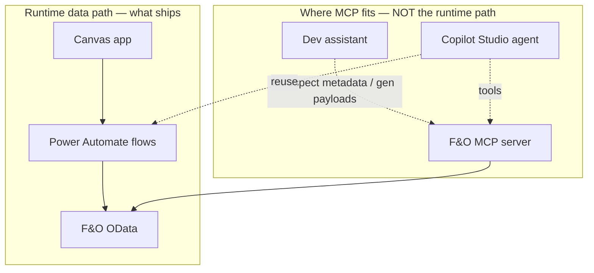

# Architecture — Quality Management Canvas App (D365 F&O)

> **Purpose of this document.** This is the single, reviewable blueprint for the whole solution.
> Read it top‑to‑bottom to verify the design **before** anything is built. Every component,
> screen, flow, F&O entity, and open decision is listed here, with a **Pre‑build verification
> sign‑off** at the end (§15). Detail lives in the sibling docs; this file is the map.
>
> Companion files: `FnO-Data-Model.md` (the F&O contract), `Screen-Flow.md` (navigation),
> `Build-Guide.md` (build order), `../flows/` (flow specs), `../canvas-app/` (app source).

---

## 1. System context

```mermaid
flowchart LR
    User([Quality / shop-floor user])
    subgraph Device[Power Apps mobile / tablet]
      App[Canvas app: QualityManagement\nUI · barcode · image capture]
    end
    subgraph PA[Power Automate]
      LF[Lookup flows\n(reads)]
      WF[Write flows\n(QO / TR / NC / BD)]
    end
    subgraph FO[Dynamics 365 F&O]
      OData[/OData /data ?cross-company=true/]
      Ent[(Quality / Batch / Ref entities\n+ business actions)]
    end
    User --> App
    App -- ".Run(args)" --> LF
    App -- ".Run(args)" --> WF
    LF -- "GET" --> OData
    WF -- "POST / PATCH / action" --> OData
    OData --> Ent
    Ent -- "rows / 201 + number" --> OData
    OData --> LF & WF
    LF & WF -- "{items} / {ok,number,message}" --> App
```

Plain‑text equivalent:

```
User → Canvas app → Power Automate flows → F&O OData (/data, cross-company=true) → F&O entities
                 ← {items} / {ok,number,message} ←            ← rows / 201 + number ←
```

The Canvas app **never** calls F&O directly. All F&O access is mediated by Power Automate flows,
so auth, `cross-company`, entity names, and error shaping live in exactly one layer.

---

## 2. Component inventory

| # | Component | Tech | Responsibility | Source |
|---|-----------|------|----------------|--------|
| 1 | `QualityManagement` app | Canvas (phone) | UI, validation, barcode scan, image capture, calls flows | `canvas-app/` |
| 2 | Lookup flows (~15) | Power Automate (Instant, PowerApps V2) | Read reference data → return JSON arrays | `flows/lookups/` |
| 3 | Write flows (5) | Power Automate (Instant, PowerApps V2) | Create/update F&O transactions → return result envelope | `flows/*.md` |
| 4 | F&O environment | D365 F&O OData | System of record | `FnO-Data-Model.md` |
| 5 | Attachment store | `DocuRefEntity` **or** Dataverse file column | Store captured images | `FnO-Data-Model.md` §F |
| 6 | (optional) Solution | Dataverse solution + connection references | ALM / source control | `solution/` |

---

## 3. Connection options — how Power Platform reaches F&O

The solution standardizes on **Option A**. B and C are documented so the choice is explicit and
reversible.

| Option | Path | Runtime? | Use it for | Trade‑off |
|--------|------|:--------:|-----------|-----------|
| **A. Flows → F&O (CHOSEN)** | App → Power Automate → **Fin & Ops Apps** connector (`shared_dynamicsax`), or **HTTP‑with‑Entra‑ID** (`shared_webcontents`) fallback | ✅ yes | All reads + writes | One extra hop; cache lookups to stay snappy |
| **B. Direct connector in app** | App → F&O connector `Filter()/Patch()` in Power Fx | ✅ yes | Read‑heavy galleries with delegation | Hard to call F&O *actions*; per‑user connection; less portable |
| **C. MCP (agent / dev layer)** | MCP server exposing F&O tools, consumed by an AI agent or by dev tooling | ⚠️ **not** by the canvas runtime | A Copilot Studio agent on top; dev‑time metadata introspection | Not a canvas data path; adds an agent/runtime to own |

### 3A. Why Option A
- F&O business operations (create quality order, change disposition) are often **bound actions**,
  not plain inserts — a flow can call them; a direct in‑app connector struggles.
- The F&O connector's apihub route is **broken in some tenants** (`BadGateway/NotFound`). Routing
  through flows lets us swap to **HTTP‑with‑Entra‑ID** without touching the app.
- One place owns `cross-company=true`, `dataAreaId`, entity names, and error mapping.

### 3B. Option C — MCP for F&O, scoped honestly
**MCP (Model Context Protocol) is an AI‑agent tooling protocol, not a transport a Canvas app can
call at runtime.** It is still worth using here, in two well‑defined places:

1. **Dev‑time acceleration (recommended, low‑risk).** Point an assistant at an **F&O / Dataverse
   MCP server** so it can introspect `$metadata`, confirm the entities marked *(confirm)* in
   `FnO-Data-Model.md`, and generate exact OData payloads. This directly de‑risks **STEP 0** of
   the build — resolving quality/NC/batch entity names is the biggest unknown. Nothing ships to
   production; it's a build‑time aid.
2. **Optional Copilot Studio agent layer (future).** If you later add a conversational agent
   ("create a customer NC for SO‑000123", "what quality orders are open?"), **Copilot Studio can
   consume MCP servers as tools.** That agent would sit *beside* the canvas app and could reuse
   the **same Power Automate flows** (wrapped as agent actions) or an MCP server that fronts F&O.



**Decision:** adopt MCP **for dev‑time entity resolution now**; keep the **agent layer as an
extension point** (§16). The canvas app's runtime path stays flows → OData regardless. If you want
an agent‑first experience instead of/alongside the canvas app, that's a scope change — flag it and
we design the agent + MCP tools explicitly.

> Prereqs if you use an F&O MCP server: an MCP server that exposes F&O (community/first‑party or a
> thin custom server over the OData endpoint), plus an Entra app registration with F&O
> read/(write) scope. For **dev‑time introspection, read‑only scope is enough** — keep it read‑only
> to avoid accidental writes during design.

---

## 4. End‑to‑end sequences

### 4A. A write (e.g. Create NC)
```mermaid
sequenceDiagram
    participant U as User
    participant S as scrNC_Form
    participant F as NC_CreateNonConformance flow
    participant O as F&O OData
    U->>S: Fill form, tap OK
    S->>S: Set(gBusy,true) + validate
    S->>F: .Run(company, ncType, dateIso, ... , description, attach)
    F->>F: Parse dims, map ncType enum
    F->>O: POST /data/NonConformanceTable?cross-company=true (dataAreaId in body)
    O-->>F: 201 + Location(NonConformanceNumber)
    opt attachment present
      F->>O: POST attachment (DocuRefEntity / Dataverse)
    end
    F-->>S: {ok:true, number:"NC-000045", message:"Non-conformance created"}
    S->>S: gBusy=false; Navigate(scrSuccess)
    S-->>U: Success card shows NC-000045
```

### 4B. A read (dropdown lookup)
```
combo.Items → ForAll(Table(ParseJSON( Lookup_X.Run(company, searchText).items )), map fields)
   Lookup_X flow → GET /data/<Entity>?cross-company=true&$select=...&$filter=... → {items: "[...]"}
```
Small static lists are cached once in `App.OnStart`; large lists pass `searchText` per keystroke.

---

## 5. Screen map (what the user sees)

```
scrSplash → scrHome ─┬─ scrQOMenu → scrQO_Form ───────────────→ scrSuccess
                     ├─ scrTRMenu → scrTR_Select → scrTR_Grid → scrSuccess
                     ├─ scrNCMenu → scrNC_Form ───────────────→ scrSuccess
                     └─ scrBDScan → scrBDConfirm ─────────────→ scrSuccess
                     (Settings: company picker + cache refresh)
```

| Function | Screens | Sources | Writes via |
|----------|---------|---------|-----------|
| Quality Order | `scrQOMenu`, `scrQO_Form` | 7 (Sales, Purchase, Inventory, Production, Route Op, Co‑Product, Quarantine) | `QO_CreateQualityOrder` |
| Enter Test Results | `scrTRMenu`, `scrTR_Select`, `scrTR_Grid` | 7 (same) | `TR_SubmitTestResult` |
| Create NC | `scrNCMenu`, `scrNC_Form` | 6 (Internal, Customer, Vendor, Service, Production, Co‑product) | `NC_CreateNonConformance` |
| Batch Disposition | `scrBDScan`, `scrBDConfirm` | barcode scan | `BD_GetBatch`, `BD_UpdateBatchDisposition` |
| Shared | `scrSuccess`, `scrSettings` | — | — |

Adaptive‑form pattern: QO's 7 sources and NC's 6 share one form each (fields show/hide by source)
— fewer screens, one place to fix. Full field‑visibility tables in `Screen-Flow.md` and the
screen specs. Barcode scan is **mobile‑only** (manual note); manual‑entry fallback provided.

---

## 6. Flow catalog (the app ↔ F&O contract)

Every write flow returns `{ ok, number, message }`; every lookup returns `{ items }` (JSON‑string
array). **`.Run()` argument order in the app must match the trigger input order exactly.**

| Flow | Inputs (order) | F&O op | Returns |
|------|----------------|--------|---------|
| `QO_CreateQualityOrder` | company, source, account, refNo, operation, item, refLot, testGroup, qty, dimsJson | POST create entity / bound action | `{ok,number,message}` |
| `TR_SubmitTestResult` | company, qualityOrderNumber, linesJson, attachName, attachB64 | PATCH lines loop / action + attach | `{ok,number,message}` |
| `NC_CreateNonConformance` | company, ncType, dateIso, problemType, account, refNo, refLot, item, dimsJson, description, attachName, attachB64 | POST create entity / action + attach | `{ok,number,message}` |
| `BD_GetBatch` | company, item, batch | GET batch | `{ok, number=currentCode, message}` |
| `BD_UpdateBatchDisposition` | company, item, batch, newCode | PATCH / action | `{ok,number,message}` |
| Lookups (~15) | company (+ search) | GET | `{items}` |

Full request bodies, the HTTP‑with‑Entra‑ID fallback shape, and catch branches are in each
`flows/*.md` file.

---

## 7. F&O entity catalog & confirmation status

Full field lists in `FnO-Data-Model.md`. **✅ = verified against this environment's live `$metadata`
(2026‑07‑14).** The earlier unknowns are resolved — this environment ships purpose‑built `PowerApp*`
quality entities, so **no custom entity is needed**.

| Purpose | Entity set | Status |
|---------|-----------|:------:|
| Customers | `CustomersV3` | ✅ |
| Vendors | `VendorsV2` | ✅ |
| Items | `ReleasedProductsV2` | ✅ |
| Sales order lines | `SalesOrderLines` (no V2) | ✅ |
| Purchase order lines | `PurchaseOrderLinesV2` | ✅ |
| Warehouses / Sites | `Warehouses` / `OperationalSites` | ✅ |
| Production orders | `ProductionOrderHeaders` | ✅ |
| Quarantine orders | `PowerAppsInventQuarantineOrders` | ✅ |
| Test groups | `QualityTestGroups` | ✅ |
| Problem types | `PowerAppProblemTypeDatas` | ✅ |
| **Quality‑order CREATE** | `QualityOrderHeaders` (`ReferenceType` enum) | ✅ |
| Test lines (read) / results (write) | `InventQualityOrderLinesPowerApp` / `QualityOrderLineResults` | ✅ |
| NC create | `AppsInventNonConformations` | ✅ (customer‑resolution *verify*) |
| Batch / disposition | `PowerAppInventBatches` (`PdsDispositionCode`) | ✅ |
| Disposition codes | `PowerAppsPdsDispositionMasters` | ✅ |
| Attachments | `DocuRefEntity` or Dataverse | ⏳ choose |

> **Resolved via direct `$metadata` introspection** (the F&O metadata endpoint is readable without a
> token). Two items remain: the NC customer‑resolution behavior (§5) and the attachment target (§9)
> — both confirmable with a single live write once the connection token is refreshed.

---

## 8. Company / legal‑entity handling
Active company held in `gCompany` (set in `App.OnStart`, switchable in Settings), passed into
every flow. Flows always add `cross-company=true` and send **lowercase** `dataAreaId` in the body.

## 9. Attachments
App captures images and sends `{ name, base64 }` to the flow. Flow stores them in either
`DocuRefEntity` (keeps image with the F&O record) or a **Dataverse file column** referencing the
F&O number. Choose one in `flows/README.md`; the app side is identical.

## 10. Security model
- **App users:** app shared + premium license + access to flow connections.
- **Flow connection identity:** an F&O **system user** (prefer a **service account**) mapped with
  a role granting read/write on the quality entities. Survives staff changes.
- **HTTP‑with‑Entra‑ID:** connection Resource URI = F&O base URL (AAD audience); sign in as a user
  with F&O write permission.
- **MCP (if used):** separate Entra app registration; **read‑only** for dev‑time introspection.

## 11. Error‑handling contract
Uniform envelope so every screen behaves identically:
```json
{ "ok": true,  "number": "NC-000045", "message": "Non-conformance created" }
{ "ok": false, "number": "",          "message": "F&O: ShippingSiteId is required" }
```
App binds `gRes.ok / .number / .message`. No screen parses raw F&O responses. Flows wrap the F&O
call in a Scope with a catch branch that fills `message` from the F&O error.

---

## 12. Key decisions (verify you agree)

| # | Decision | Rationale |
|---|----------|-----------|
| D1 | Flow‑mediated F&O access (Option A) | Portability, action support, single auth/`cross-company` point |
| D2 | HTTP‑with‑Entra‑ID as fallback connector | Survives broken F&O apihub routing without app changes |
| D3 | Adaptive forms (1 per QO/NC) not 1‑per‑source | Fewer screens, one place to fix, consistent UX |
| D4 | Uniform `{ok,number,message}` envelope | Uniform success/error handling everywhere |
| D5 | Lookups cached in collections | Instant dropdowns; Refresh re‑pulls |
| D6 | Company explicit via `dataAreaId` | Never rely on the connection's default company |
| D7 | Clean redesign, screenshots as reference only | Modern, consistent theme vs pixel copy |
| D8 | MCP = dev‑time + optional agent layer, **not** the runtime path | Honest scoping; canvas can't consume MCP at runtime |
| D9 | Phone form factor first | Shop‑floor / mobile‑first; barcode needs mobile app |

## 13. Assumptions
- You have a licensed F&O environment + a mappable service account with quality write access.
- Premium Power Platform licensing is available (F&O / Dataverse / HTTP‑with‑Entra‑ID are premium).
- The quality‑order/NC create paths can be satisfied by an entity or a bound action (custom entity
  built if needed).
- Attachments are acceptable in `DocuRefEntity` or Dataverse.

## 14. Risks & mitigations
| Risk | Impact | Mitigation |
|------|--------|-----------|
| No standard quality‑order create entity | Blocks QO function | STEP 0: confirm/build custom entity or action (use MCP/metadata to verify) |
| F&O connector apihub broken in tenant | Flows fail | Switch to HTTP‑with‑Entra‑ID (D2) — no app change |
| Entity/field name drift by version | 400/404 errors | Confirm every ⚠ against `$metadata` before building |
| Barcode unsupported on web | Batch disposition unusable in browser | Mobile app + manual‑entry fallback |
| Large lookups slow | Sluggish dropdowns | `search` param + `$top` cap + caching |

---

## 15. ✅ Pre‑build verification sign‑off

Confirm each before STEP 1. (Same list drives `deploy/checklist.md` block A.)

**Scope & UX**
- [ ] The 4 functions + their sources (7/7/6/scan) match what you want to ship.
- [ ] Adaptive‑form approach (D3) is acceptable vs one screen per source.
- [ ] Phone‑first form factor (D9) is right for your users.
- [ ] Redesign (not screenshot copy) is approved.

**Connection & MCP**
- [ ] Option A (flows) approved as the runtime path.
- [ ] Connector choice: Fin & Ops connector ☐  /  HTTP‑with‑Entra‑ID ☐  (fallback understood).
- [ ] MCP scope agreed: dev‑time introspection ☐  /  future agent layer ☐  /  not now ☐.

**F&O readiness (the ⚠ list, §7)**
- [ ] F&O base URL recorded: ________________________
- [ ] `dataAreaId` codes recorded: ________________________
- [ ] Quality‑order **create path** resolved: ________________________
- [ ] Test‑result submit path resolved: ________________________
- [ ] NC create path resolved: ________________________
- [ ] Batch entity confirmed: ________________________
- [ ] Attachment target chosen: ________________________
- [ ] Service account has F&O user mapping + write role.

**Sign‑off:** name ______________  date __________  → proceed to `Build-Guide.md` STEP 1.

---

## 16. Extension points
- **Copilot Studio agent + MCP** (§3B) — conversational create/query over the same flows/entities.
- Offline draft capture (SaveData/LoadData) for unreliable shop‑floor Wi‑Fi.
- Approvals before an NC is submitted.
- Power BI tile on Home (open quality‑order counts).
- Dual‑write / virtual tables if the org standardizes these entities on Dataverse.
